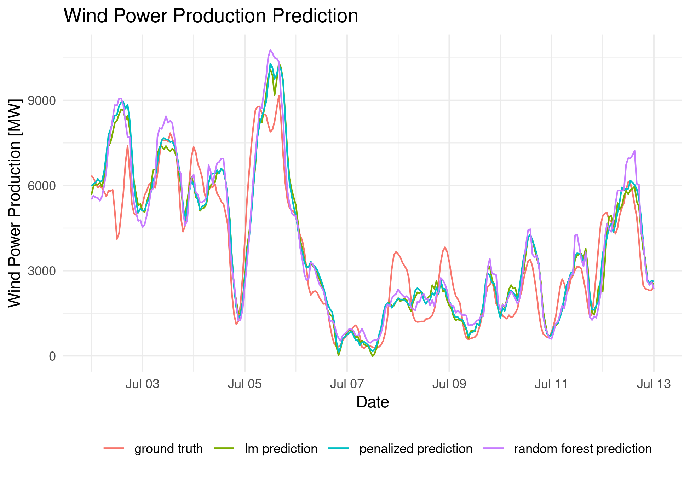

# Analysis of Wind Power in Germany

This project aims to explore and model wind power generation data in Germany.
The goal is to understand the relationship between wind speed in different areas and generated power.
The influence that different areas have on power output is visualized, and different models are used to predict power production baesd on wind data.

In reality, this project is a mock project aimed to teach an organized project folder setup, as well as some key tools for reproducibility.
This project is NOT meant to represent a good or statistically valid approach!



## Project Overview

Wind power is a crucial component of the renewable energy landscape, and Germany has been a pioneering force in integrating wind energy into its power grid.
This project combines power generation data from Transmission System Operators (TSOs) with wind data provided by the Deutscher Wetterdienst (DWD).
By binning wind speed data into geographical cells, we aim to build a model that can predict wind power generation.

Wind speed data is compiled through the 'https://opendata.dwd.de' API, power generation data was downloaded from 'SMARD.de'.

## Key Objectives

- **Data Exploration:** Investigate the power generation data, examining differences by company, time of day and time of year.
- **Influences of Wind in Different Grid Cells:** By measuring the influence of wind variation in different grid cells on power production, we can reconstruct the main areas of responsibility of the big four TSOs.
- **Modeling:** Fit various models to predict energy production based on wind data.

## Usage

Below are the steps for loading wind data, power data, and fitting a linear model:

```r
source("source_all.R")

# load location data of weather stations
data.stations.grid <- readDataStationsRaw() |> getStationsGrid()

# load energy production data
data.energy <- readDataEnergy()

# load wind data and average it for each grid cell
data.wind <- readDataWindRaw() |> getWindInGrid(data.stations.grid)

# Transform wind data into "wide" format for model
data.wind.wide <- windToWide(data.wind)

# Merge wind data with energy data and subset to between cutoff dates
data.modelinput <- buildModelData(
  data.wind.wide, data.energy,
  start.date.train, end.date.train
)

# fit a linear model
fitModelLM(data.modelinput)
```

## Acknowledgements

We would like to thank Dick Brown for his report ['Analysis of German Wind Power Output'](https://www.kaggle.com/code/dickbrown/german-wind-power) on Kaggle for the idea to analyze wind power production data of Germany.

The power production data is courtesy of 'Bundesnetzagentur | SMARD.de'.

The wind data was compiled from 'https://opendata.dwd.de' of the 'Deutscher Wetterdienst'.
