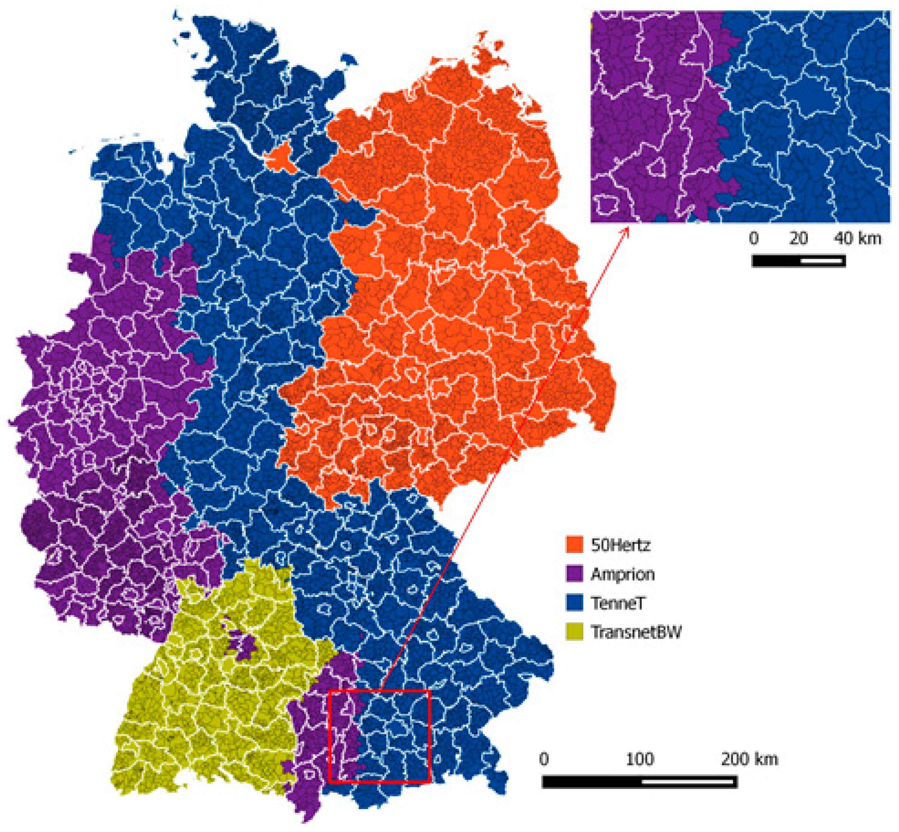

```{r setup, include=FALSE}
knitr::opts_chunk$set(echo = FALSE, fig.pos = "H", message = FALSE, warning = TRUE)

source("source_all.R")
```

\newpage

\tableofcontents

\listoftables

\listoffigures

\newpage

# Introduction

As the global shift towards sustainable energy sources accelerates, wind power stands out as a prominent player in the renewable energy landscape, generating electricity with low environmental impact.
In this report, we attempt to analyze, model, and predict wind power production based on wind speed data.

## Wind Power in Germany

Wind Power has become a pillar of power generation in Germany, responsible for the production of $27\%$ of the consumed electricity in 2021 [@windeurope].
E.g.\ 2022 has seen the installation of 551 onshore wind farms worth 2403MW of power [@bwe].

```{r prepare}
data.stations.raw <- readDataStationsRaw()
data.stations.grid <- getStationsGrid(data.stations.raw)

# SOLUTION
tablesfile <- file.path(path.intermediate, "tables.rds")
if (file.exists(tablesfile)) {
  tables <- readRDS(tablesfile)
  data.energy <- tables$data.energy
  data.wind <- tables$data.wind
  rm(tables)
} else {
# SOLUTION END
  data.energy <- readDataEnergy()
  data.wind <- getWindInGrid(readDataWindRaw(), data.stations.grid)
# SOLUTION
  saveRDS(list(
    data.energy = data.energy,
    data.wind = data.wind
  ), tablesfile)
}
# SOLUTION END

data.energy.daily <- getEnergyDaily(data.energy)
```

In this report, we will analyze wind power production data from the big four German transmission system operators (50 Hertz, Amprion, TenneT TSO and TransnetBW) for the timeframe of June 2022 to October 2023 (@powerDat).
The Measurements record the energy generated in intervals of 15 minutes and are therefore in units of MWh per 15min (Table \ref{tbl:summary})

```{r tbl:summary}
split(data.energy$wind.energy, data.energy$operator) |>
  vapply(summary, numeric(6)) |> round(1) |>
  knitr::kable(caption =
    "Summary of 15 minte interval wind power production data for each investigated company.\\label{tbl:summary}"
  )
```

There is a universal dip of power production over all companies during the day as well as in the summer months (see Figure \ref{fig:totalwind}).
This is to be expected and may reflect total power demand more than it does the capability of wind power production.

For all following anaylsis and models, Wind PP values are multiplied by 4 to convert into MW as average Power over 15 minutes instead of MWh/15min.


```{r lineTotalComp, out.width="50%", fig.ncol = 2,  fig.align="center", fig.subcap=c("Average daily windspeed", "Daily wind energy production for each operator."), fig.cap="\\label{fig:totalwind}Wind speed and wind energy production throughout the period being analyzed."}
plotWindDaily(data.wind)
ggsave("plots/WindSpeed.png", device = "png")

plotPowerDaily(data.energy.daily)
ggsave("plots/lineTotalComp.png", device = "png")
```

## Wind Speed Data

To fit a power production prediction Model, we will use Data of wind speeds in Germany over that same time window.
This data was compiled from weather stations of DWD [@windDat] and only weather stations active throughout the entire time were used.
`NA` measure values were removed.

Measure station location was binned into a 4 x 4 grid (see Figure \ref{fig:gridOnMap}).
Stations outside of the desired grid were pushed into the closest cell which mainly affects stations too far east.

```{r getNvis Wind data, out.width = "60%", fig.align="center", fig.cap="\\label{fig:gridOnMap}Aggregation to grid of active weather Stations in Germanys"}
plotWindStations(data.stations.raw)
ggsave("plots/gridOnMap.png", device = "png")
```


Wind speeds vary over the year (see Figure \ref{fig:totalwind}), as well as over the time of day.
In Figure \ref{fig:winddaily} we can see that averaged over the whole year, wind power production reduces during the day, but wind speed increases.

```{r windToPowerDaily, out.width="60%", fig.align="center", fig.cap="\\label{fig:winddaily}Average power production and wind speed (averaged over all grid cells) for each time of day (UTC)."}
plotHourly(convertEnergyToPower(data.energy), data.wind)
ggsave("plots/lineinDaywithWind.png", device = "png")
```

# Model

We will attempt to model wind power production by the Wind Speed in each grid field.
Since average wind power production throughout the day seems to follow a different pattern than average wind speed, we use a different intercept for each hour of the day.
This way, we effectively model how the wind speeds in each cell effect the deviation of wind power from the average at a particular hour.

$$
\text{Power}_i = \beta_{0,\text{TimeOfDay}(i)} + \beta_1 \text{Wind@Grid.01}_{i} + ... +\beta_{16} \text{Wind@Grid.16}_{i}
$$

```{r model linear}
data.wind.wide <- windToWide(data.wind)

data.modelinput <- buildModelData(data.wind.wide, data.energy, start.date.train, end.date.train)

# linear model
model.lm <- fitModelLM(data.modelinput)
```

We can visualize the effect that the average wind on each grid cell has on power production as in Figure \ref{fig:squares} (a)
The fact that some grid cells have a negative coefficient is a strong hint that there are some important relationships that our model fails to capture correctly.
Remember that this project is supposed to teach you how to set up a project directory, not how to model wind energy production well!

Using the `penalized` package, we can restrict the value of grid cell coefficients to positive values, and furthermore use L1 regularization to prefer coefficients with value 0 when they do not have a large effect. Figure \ref{fig:squares} (b) shows the coefficients of the penalized model.

```{r model penalized}
# SOLUTION
set.seed(1)
# SOLUTION END
model.penalized <- fitModelPenalized(data.modelinput = data.modelinput)
```

```{r squares, out.width="50%", fig.align="center", fig.ncol = 2, fig.cap="\\label{fig:squares}Grid squares colored by Beta value of models.", fig.subcap = character(2)}
colSquare(coef(model.lm), data.stations.raw, title = "Linear Model Coefficients")

colSquare(coef(model.penalized), data.stations.raw, title = "Penalized Linear Model Coefficients")
```
We can fit the penalized model on the subset of the data for each transmission system operator (Figure \ref{fig:squaresByOperator} (a)--(d)) and compare that with the actual areas of responsibility of each operator (Figure \ref{fig:squaresByOperator} (e)). 

```{r squaresByOperator, out.width="50%", fig.ncol = 2, fig.align="center", fig.cap="\\label{fig:squaresByOperator}(a) -- (d): Grid squares colored by penalized beta coefficients for each transmission system operator. (e): Map of control areas of german transmission system operators.", fig.subcap = c(character(4), "Source: Robinius 2017")}
# SOLUTION
set.seed(2)
# SOLUTION END
operators <- unique(data.energy$operator)


models <- lapply(operators, function(op) {
  pd <- subset(data.energy, operator == op)
  md <- buildModelData(data.wind.wide, pd, start.date.train, end.date.train)
  fitModelPenalized(data.modelinput = md)
})

for (i in seq_along(operators)) {
  print(colSquare(coef(models[[i]]), data.stations.raw, operators[[i]]))
}


```

## Prediction of Wind Power Production

Using these models, we predict the wind power production in Germany using wind speed data (Figure \ref{fig:prediction}).
We also try out a random forest model from the `ranger` package.
This could then later be used to predict future power production based on predicted weather Data.

```{r prediction, out.width="80%", fig.align="center", fig.cap="\\label{fig:prediction}Prediction of wind power production based on wind speed data."}
# SOLUTION
set.seed(3)
# SOLUTION END
data.predict <- buildModelData(data.wind.wide, data.energy, start.date.predict, end.date.predict, keep.datetime = TRUE)

prediction.lm <- predictModelLm(model.lm, data.predict)
prediction.penalized <- predictModelPenalized(model.penalized, data.predict)
prediction.ranger <- fitPredictModelRanger(data.modelinput = data.modelinput, data.predict = data.predict)

plotPredictedWindEnergy(data.predict$datetime, list(
  `ground truth` = data.predict$wind.energy,
  `lm prediction` = prediction.lm,
  `penalized prediction` = prediction.penalized,
  `random forest prediction` = prediction.ranger
))

ggsave(filename = "plots/windPowerPrediction.png", device = "png")
```

# Summary

This report is only meant to teach how to set up a project directory.
Therefore, the analysis or prediction modelling done here should not be seen as a good example of how to ideally tackle the task at hand.

# Acknowledgements {.unlisted .unnumbered}

We would like to thank Dick Brown for his report ['Analysis of German Wind Power Output'](https://www.kaggle.com/code/dickbrown/german-wind-power) on Kaggle for the idea to analyze wind power production data of Germany.
  
The power production data is courtesy of 'Bundesnetzagentur | SMARD.de'.

The wind data was compiled from 'https://opendata.dwd.de' of the 'Deutscher Wetterdienst'.

\section{References}
